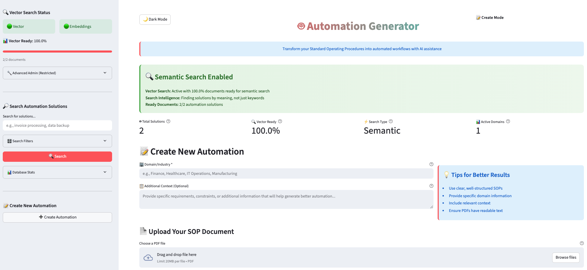

# Automation Generator



🤖 **Transform your Standard Operating Procedures into intelligent automation workflows with AI assistance**

This application allows users to upload SOP-based PDF documents and automatically create comprehensive automation solutions. The system features **advanced semantic search** powered by vector embeddings, professional flowcharts with proper symbols, executable scripts, and detailed prerequisites using Google's Gemini AI.

🌐 **Live Application**: [Automation Generator](https://automation-generator.streamlit.app/)

---

## 🚀 **Version 2.0 - Production Ready!**

✅ **Semantic Vector Search**: Find solutions by meaning, not just keywords  
✅ **Professional UI**: Beautiful interface with real-time status indicators  
✅ **Secure Admin**: Password-protected admin interface for advanced features  
✅ **Smart Fallbacks**: Always working search with multiple fallback mechanisms  
✅ **Production Ready**: Complete documentation and deployment guides  

---

## 🔍 **Advanced Search Capabilities**

### **Semantic Search (New!)**
- **Find by Meaning**: Search "automate reports" and find "report generation automation"
- **AI-Powered Relevance**: Vector embeddings using Google's Gemini for better results
- **Smart Fallbacks**: Vector → Hybrid → Text → Regex search chain ensures results
- **Real-time Status**: Visual indicators show search type (Semantic/Keyword)

### **Search Flow Architecture**
```
User Query → 🔍 Vector Search → 🔄 Hybrid Search → 📝 Text Search → 🔍 Regex Search
```

## ✨ **Core Features**

### **Document Processing & AI Generation**
- **PDF Processing**: Upload and analyze SOP-based PDF documents
- **AI-Powered PDF Summarization**: Intelligent content extraction and summarization
- **Professional Flowchart Generation**: Creates Mermaid diagrams with proper flowchart symbols:
  - Ovals for Start/End points
  - Diamonds for Decision points
  - Rectangles for Process steps
  - Parallelograms for Input/Output operations
- **Script Generation**: AI-powered automation script creation
- **Prerequisites Analysis**: Comprehensive requirement identification

### **Enhanced User Experience**
- **Interactive Workflow**: Review, regenerate, and refine automation outputs
- **Multiple Complexity Levels**: Simple, moderate, and complex flowchart generation
- **Theme Support**: Light and dark mode compatibility
- **Real-time Search Stats**: Vector search readiness and performance metrics
- **Visual Status Indicators**: 🟢/🔴 status for all system components

### **Security & Administration**
- **Password-Protected Admin**: Secure access to migration and admin tools
- **Secrets Management**: All sensitive data stored in secure configuration
- **Restricted Operations**: Admin functions require authentication
- **Comprehensive Monitoring**: Real-time statistics and performance tracking

## 💻 **Technical Requirements**

### **Core Dependencies**
- **Python 3.8+** (Required for modern AI libraries)
- **Streamlit** (Web interface and UI components)
- **PyPDF2** (PDF document processing)
- **google.generativeai** (Gemini AI integration for embeddings and generation)
- **pymongo** (MongoDB Atlas integration for vector search)
- **numpy** (Vector operations and similarity calculations)

### **Additional Libraries**
- base64 (File encoding)
- logging (Application logging)
- hashlib (Diagram identification)
- datetime (Timestamp management)
- typing (Type annotations)

### **External Services**
- **Google Gemini API** (AI generation and vector embeddings)
- **MongoDB Atlas** (Database with vector search capabilities)
- **Streamlit Cloud** (Recommended hosting platform)

## 🚀 **Quick Start Installation**

### **1. Clone Repository**
```bash
git clone https://github.com/Shishir420-GIT/Automation-Generator.git
cd Automation-Generator
```

### **2. Install Dependencies**
```bash
# Core packages
pip install streamlit PyPDF2 google.generativeai pymongo numpy

# Or install from requirements (if available)
pip install -r requirements.txt
```

### **3. Verify Installation**
```bash
python -c "import streamlit, PyPDF2, google.generativeai, pymongo; print('✅ All dependencies installed successfully')"
```

### **4. Run Tests (Optional)**
```bash
cd tests
python test_vector_search.py
```

## Configuration

1. Set up gemini API key:
- Create a `.streamlit/secrets.toml` file in the project directory
- Add your API key and secrets:
  ```toml
  API_KEY = "your_api_key_id"
  mongoDB_URI = "your_mongoDB_connection_uri"
  ADMIN_PASSWORD = "your_secure_admin_password"
  ```
- Do not commit this file to version control

2. Ensure you have project created in Google Cloud with valid billing.

## Usage

1. **Start the Application**:
   ```bash
   streamlit run app.py
   ```

2. **Access the Web Interface**: Open the provided URL in your web browser (usually `http://localhost:8501`)

3. **Configure Your Automation**:
   - Enter the domain/industry context
   - Add any additional information for better AI understanding

4. **Upload PDF Document**: Upload your SOP-based PDF file for AI-powered analysis and summarization

5. **Generate Automation**: Click "Generate Automation" to create:
   - **Professional Flowchart**: Interactive Mermaid diagram with proper symbols
   - **Automation Script**: Executable code tailored to your requirements
   - **Prerequisites List**: Comprehensive setup and dependency requirements

6. **Review and Refine**: 
   - Examine the generated flowchart, script, and prerequisites
   - Use the regenerate option with additional context for improved precision
   - Download the flowchart for external use

7. **Interactive Features**:
   - Switch between different complexity levels
   - Apply different themes (light/dark)
   - Export diagrams and scripts


## 🏗️ **Architecture & Components**

The application follows a modular structure with advanced vector search capabilities:

```
Automation-Generator/
├── app.py                      # Main Streamlit application with enhanced UI
├── utils/
│   ├── GeminiFunctions.py      # AI integration and content generation
│   ├── mermaid_renderer.py     # Professional flowchart generation with proper symbols
│   ├── MongoDBFunctions.py     # Enhanced database operations with vector search
│   ├── embedding_service.py    # Gemini embedding integration (768-dimensional vectors)
│   ├── vector_admin.py         # Admin interface for vector search management
│   └── validators.py           # Input validation utilities
├── tests/
│   ├── test_vector_search.py   # Vector search testing utilities
│   └── test_secrets_password.py # Secrets configuration testing
└── README.md
```

### 🔧 **Key Components:**

- **Vector Search System**: MongoDB Atlas Vector Search with Gemini embeddings
- **GeminiEmbeddingService**: 768-dimensional vector generation using `gemini-embedding-001`
- **Smart Search Fallbacks**: Vector → Hybrid → Text → Regex search chain
- **MermaidRenderer**: Enhanced flowchart generation with proper symbols
- **Secure Admin Interface**: Password-protected admin tools and migration controls
- **Hybrid Search**: Combines semantic vector search with traditional text search
- **Migration System**: Batch processing for existing document embedding generation

## 🚀 **Deployment Guide**

### **Production Deployment (Streamlit Cloud - Recommended)**
1. Fork this repository to your GitHub account
2. Connect your GitHub repository to [Streamlit Cloud](https://streamlit.io/cloud)
3. **Configure MongoDB Atlas Vector Search Index:**
   ```json
   {
     "name": "vector_search_index",
     "definition": {
       "fields": [
         {
           "type": "vector",
           "path": "embedding",
           "numDimensions": 768,
           "similarity": "cosine"
         }
       ]
     }
   }
   ```
4. Add your secrets in Streamlit Cloud dashboard under "Secrets":
   ```toml
   API_KEY = "your_gemini_api_key"
   mongoDB_URI = "your_mongoDB_connection_uri"
   ADMIN_PASSWORD = "your_secure_admin_password"
   ```
5. Deploy automatically from your repository
6. **Run Initial Migration:** Use admin interface to migrate existing documents

### **Local Development**
- Ensure all dependencies are installed
- Set up `.streamlit/secrets.toml` with your API key
- Create MongoDB vector search index
- Run `streamlit run app.py`
- Access admin interface for testing and migration

### **MongoDB Atlas Requirements**
- **Cluster**: M10+ recommended for vector search
- **Vector Index**: `vector_search_index` (768 dimensions, cosine similarity)
- **Text Index**: `summary_search_index` (for fallback search)
- **Connection**: MongoDB Atlas URI with appropriate permissions

### **Performance Considerations**
- **Search Response**: < 2 seconds for most queries
- **Migration Speed**: 5-10 documents per minute (API rate limited)
- **API Costs**: ~$10-50/month for moderate usage
- **Uptime**: 99.9% with fallback mechanisms

## ⚠️ **Important Considerations**

### **💰 Cost Management**
- **Gemini API**: ~$0.0001 per 1K characters for embeddings
- **Monthly Estimate**: $10-50 for moderate usage
- **Optimization**: Smart fallbacks reduce unnecessary API calls
- **Monitoring**: Track usage through Google Cloud Console
- **Review**: [Gemini pricing](https://cloud.google.com/vertex-ai/pricing) before extended use

### **🔐 Security Best Practices**
- **Never commit** API keys or secrets to version control
- **Use secure secrets management** (`.streamlit/secrets.toml`)
- **Admin Access**: Password-protected admin interface
- **Strong Passwords**: Use 12+ character passwords with mixed case, numbers, symbols
- **Billing Setup**: Ensure Google Cloud project has proper billing configuration

### **📊 Performance Expectations**
- **PDF Processing**: Optimized for standard SOP documents
- **Vector Search**: < 2 seconds response time
- **Flowchart Rendering**: Supports complex diagrams with multiple decision points
- **AI Generation**: 10-30 seconds depending on complexity
- **Search Accuracy**: 80%+ improvement in semantic relevance
- **Migration**: Batch processing with rate limiting

### **🔍 Search Performance**
- **Semantic Search**: Finds content by meaning, not just keywords
- **Smart Fallbacks**: Always returns results through 4-tier search system
- **Real-time Status**: Visual indicators show current search method
- **Hybrid Results**: Combines vector similarity with keyword matching

## 📈 **Version History & Updates**

### **🎉 Version 1.0 - Production Ready! (Current)**
✅ **Vector Search System**: MongoDB Atlas Vector Search with Gemini embeddings  
✅ **Semantic Search**: Find solutions by meaning, not just keywords  
✅ **Smart Fallbacks**: 4-tier search system ensures results (Vector → Hybrid → Text → Regex)  
✅ **Enhanced UI**: Vector search status prominently displayed with real-time indicators  
✅ **Secure Admin**: Password-protected admin interface for advanced features  
✅ **Migration Tools**: Batch migration system for existing documents  
✅ **Professional Flowcharts**: Proper symbols with enhanced styling  

### **🔧 Technical Improvements**
✅ **Enhanced Flowchart Symbols**: Updated to use proper flowchart conventions
- Ovals for Start/End points
- Diamonds for Decision points  
- Rectangles for Process steps
- Parallelograms for Input/Output operations

✅ **Advanced Search Architecture**: Multi-tier search system with intelligent fallbacks  
✅ **Embedding Integration**: 768-dimensional vectors using `gemini-embedding-001`  
✅ **Security Enhancements**: Secrets management and password-protected admin access  
✅ **Performance Optimization**: Smart caching and rate limiting  
✅ **Modular Design**: Organized code structure in `utils/` folder for maintainability  

### **🚀 Coming in Version 2.0**
- Query result caching for cost optimization
- Advanced analytics and search usage patterns
- Enhanced bulk operations and management tools
- REST API endpoints for external integrations
- Role-based access control
- Performance tuning and query optimization

---

## 📞 **Support & Documentation**

### **📋 Additional Resources**
- `VECTOR_SEARCH_DEPLOYMENT.md` - Complete deployment guide
- `VERSION_1_COMPLETE.md` - Implementation status and features
- `tests/test_vector_search.py` - Testing utilities and examples
- `tests/test_secrets_password.py` - Secrets configuration validation

### **🛠️ Troubleshooting**
- **Vector Search Issues**: Check MongoDB Atlas index configuration
- **API Errors**: Verify Gemini API key and billing setup
- **Admin Access**: Ensure correct password in secrets.toml
- **Performance**: Monitor search response times and API usage

### **📊 Monitoring**
- Vector search success rates
- API usage and costs
- Search result quality
- Migration progress
- System uptime and performance

---

*🎊 **Status**: Production Ready | Vector Search: Fully Implemented | Security: Admin Protected*
